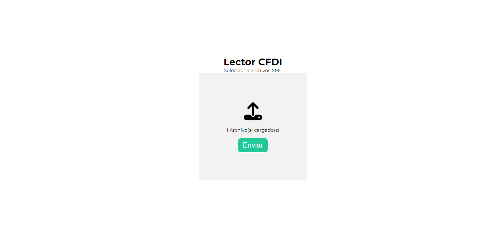

# Lector CFDI

Lector de archivos CFDI XML

## Table of contents

- [Lector CFDI](#lector-cfdi)
  - [Table of contents](#table-of-contents)
  - [Overview](#overview)
    - [Screenshot](#screenshot)
    - [Links](#links)
  - [My process](#my-process)
    - [Built with](#built-with)
  - [Author](#author)

**Note: Delete this note and update the table of contents based on what sections you keep.**

## Overview

Lee archivos CFDI y muestra valores esenciales de las facturas

### Screenshot

### Links

- Solution URL: [Github Repo.](https://github.com/vidaencodigo/Lector-CFDI)

## My process

### Built with

- Semantic HTML5 markup
- CSS custom properties
- Flexbox
- PHP

## Author

- Website - [Emmanuel](http://www.emmanuelurbina.github.io)
- Twitter - [@emmanuelluur](https://www.twitter.com/emmanuelluur)